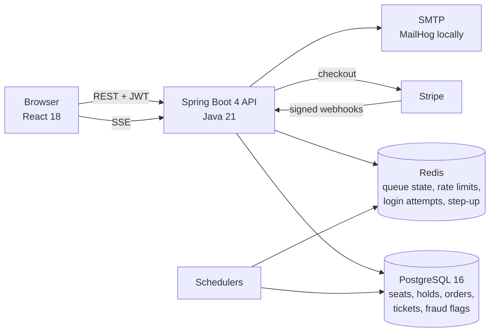

# FairTix

Concert tickets without the fluff. A ticketing platform built to survive an
on-sale: a waiting room that admits fans in batches, seat holds that cannot be
double-sold, fraud scoring on risky orders, and Stripe payments with verified
webhooks.

[](https://github.com/firegiant9000/FairTix/actions/workflows/ci.yml)

> **Status:** University team project (Spring 2026) that I continued through
> milestones M1 to M8 after the course. It runs end to end locally with Docker
> Compose. It has never been deployed to production and has no live users.
> Stripe and reCAPTCHA are integrated but disabled by default.

<!-- Screenshots: docs/screenshots/ does not exist yet. Capture the event page,
     the waiting room, the seat map with a live hold, and the organizer
     settlement view, then link them here. -->

## Engineering highlights

- **Seat holds use PostgreSQL row locks, not Redis.**
  [`SeatRepository`](backend/src/main/java/com/fairtix/inventory/infrastructure/SeatRepository.java)
  locks the requested seats with `LockModeType.PESSIMISTIC_WRITE`, and
  [`SeatHoldService`](backend/src/main/java/com/fairtix/inventory/application/SeatHoldService.java)
  sorts seat IDs before locking so two concurrent holds on overlapping seats
  cannot deadlock. Holds carry an expiry, and
  [`HoldExpirationScheduler`](backend/src/main/java/com/fairtix/inventory/scheduler/HoldExpirationScheduler.java)
  sweeps expired holds back to available every 30 seconds.
- **Waiting room over Server-Sent Events.**
  [`QueueService`](backend/src/main/java/com/fairtix/queue/application/QueueService.java)
  keeps position counters and the admitted set in Redis (Redisson), admits fans
  in configurable batches, and
  [`QueueSseService`](backend/src/main/java/com/fairtix/queue/application/QueueSseService.java)
  pushes position updates to each connected browser. Creating a hold checks
  admission first, so skipping the queue is not possible from the client.
- **Fraud scoring with step-up authentication.** The
  [`fraud`](backend/src/main/java/com/fairtix/fraud) package scores orders from
  suspicious-activity flags, payment failures and account age
  (`RiskScoringService`), runs a scheduled behaviour sweep, and gates high-risk
  actions behind a step-up challenge (`StepUpGateService`, `StepUpFilter`).
  Admins can review flags through `FraudAdminController`.
- **Stripe webhooks are signature-verified.**
  [`StripeWebhookController`](backend/src/main/java/com/fairtix/payments/api/StripeWebhookController.java)
  reconstructs every event with `Webhook.constructEvent` and rejects anything
  that fails verification. Refund completion is not yet idempotent against a
  redelivered event; see Limitations.
- **Rate limiting and abuse controls.** Per-route limits keyed by user or IP
  through Redisson rate limiters (`RateLimitService`), login-attempt tracking,
  reCAPTCHA on login, and velocity limits on ticket transfers.
- **Security gates in CI.** Every pull request runs the backend tests, the
  frontend tests with coverage, OWASP Dependency-Check, and a Trivy scan of the
  backend image that fails on CRITICAL or HIGH findings.

## Architecture



The backend is organised by domain (`events`, `inventory`, `queue`, `orders`,
`payments`, `refunds`, `tickets`, `fraud`, `auth`, `users`, `venues`,
`analytics`, `audit`, `support`, `notifications`), each split into `api`,
`application`, `domain` and `infrastructure` layers. Schema changes are
forward-only Flyway migrations under
`backend/src/main/resources/db/migration` (28 so far).

## Tech stack

| Layer | Choice |
| --- | --- |
| Backend | Java 21, Spring Boot 4.0, Spring Security, Spring Data JPA |
| Database | PostgreSQL 16, Flyway migrations |
| Cache and coordination | Redis 7 via Redisson |
| Payments | Stripe (checkout and signed webhooks), disabled by default |
| Frontend | React 18 (Create React App), served on port 3000 |
| Email | Spring Mail; MailHog in development |
| Build and test | Maven wrapper, JUnit 5, Jest |
| CI | GitHub Actions: build, tests, OWASP Dependency-Check, Trivy |
| Local runtime | Docker Compose |

## Running it locally

Requirements: Docker and Docker Compose.

```bash
git clone https://github.com/firegiant9000/FairTix.git
cd FairTix
cp .env.example .env
docker compose up --build
```

Set `POSTGRES_PASSWORD` and `JWT_SECRET` in `.env` before the first start
(`JWT_SECRET` must be at least 64 characters). Nothing else is required to
see the app: Stripe and reCAPTCHA stay off until you set their keys.

| Service | URL |
| --- | --- |
| Frontend | http://localhost:3000 |
| API | http://localhost:8080 |
| Swagger UI | http://localhost:8080/swagger-ui.html |
| MailHog | http://localhost:8025 |

`docker compose down` stops everything. Flyway applies migrations on backend
start. Optional Stripe and reCAPTCHA setup, and the full environment-variable
table, are in [DEPLOY.md](DEPLOY.md), [docs/stripe-setup.md](docs/stripe-setup.md)
and [docs/recaptcha-setup.md](docs/recaptcha-setup.md). The API surface is
documented in [docs/api-contract.md](docs/api-contract.md).

## Tests and CI

```bash
cd backend && ./mvnw verify                 # 285 JUnit tests across 45 classes
cd frontend/webpages && npm test -- --coverage
```

Backend tests cover seat-hold concurrency, queue admission, risk scoring,
step-up gating, refunds, and webhook handling. The CI workflow
([.github/workflows/ci.yml](.github/workflows/ci.yml)) runs on every pull
request to `main`: `mvn clean verify` with a Redis service container, the
frontend suite with coverage, OWASP Dependency-Check, and a Trivy image scan.

## Security notes

- Passwords are BCrypt-hashed; sessions are short-lived JWT bearer tokens signed
  with `JWT_SECRET` (see [docs/api-contract.md](docs/api-contract.md)).
- Every secret comes from `.env` (gitignored). `.env.example` holds names and
  placeholders only.
- Stripe webhooks are rejected unless the signature verifies against
  `STRIPE_WEBHOOK_SECRET`; with Stripe enabled but no secret set, the endpoint
  rejects everything.
- Rate limits, login-attempt tracking, reCAPTCHA and step-up challenges are
  the abuse controls. None of this has been penetration tested.

## Limitations

- Never deployed; no real traffic, no production hardening beyond the above.
- The SSE registry is in-memory, so the waiting room works on a single backend
  instance only.
- Refund webhooks are verified but not deduplicated. A redelivered
  `charge.refunded` event can re-run refund completion.
- Backend tests run without a PostgreSQL service in CI, so repository-level
  behaviour against a real database is exercised locally, not in CI.
- No end-to-end browser tests.

## Team and contributions

FairTix started as a six-person course project at the University of Louisiana
at Lafayette in Spring 2026: Arlo Kharod, Maddux Vitrano, Zoe Dominguez,
Skylar Rader, Sophie LaGraize and Matheus Nery.

**Arlo Kharod** ([@firegiant9000](https://github.com/firegiant9000), committing
as `ArloK223`) authored roughly 70% of the commits and all of the milestone
pull requests (M1 to M8). Sole author of the `queue` (SSE waiting room) and
`fraud` packages; primary author of `inventory` (seat holds and locking),
`payments` (Stripe), `refunds`, `orders`, `tickets` (transfers), the audit
trail, the CI pipeline, and most of the React frontend.

**Teammates:** Maddux Vitrano (dependency upgrades, method security, the logo,
early inventory work, and the webcrawler tooling in the open PR); Zoe
Dominguez (reCAPTCHA integration, rate-limit keying and tests, payment-record
migrations, Redis in CI); Matheus Nery (service tests and backend fixes);
Sophie LaGraize (request logging with MDC, login and signup error handling);
Skylar Rader (frontend pages and logo sizing).

Contribution conventions are in [CONTRIBUTING.md](CONTRIBUTING.md). Planning
history lives in [docs/planning](docs/planning).

## License

[MIT](LICENSE). Contributors are listed under Team and contributions above.
